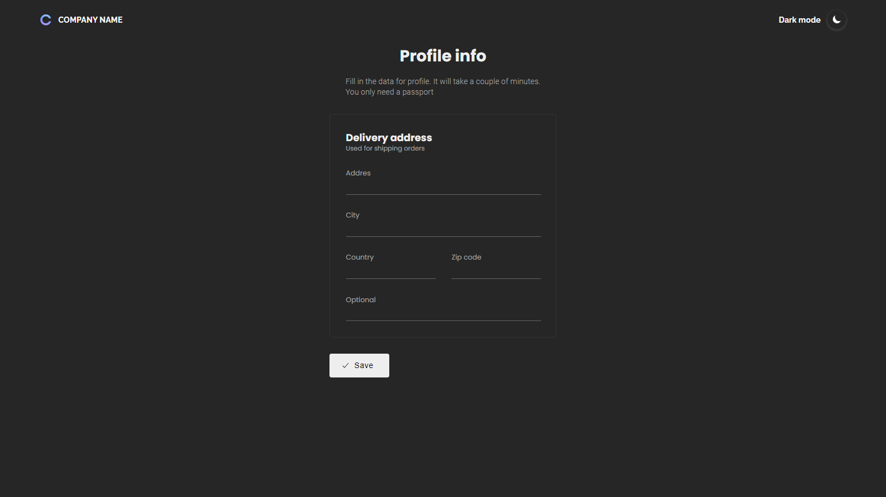
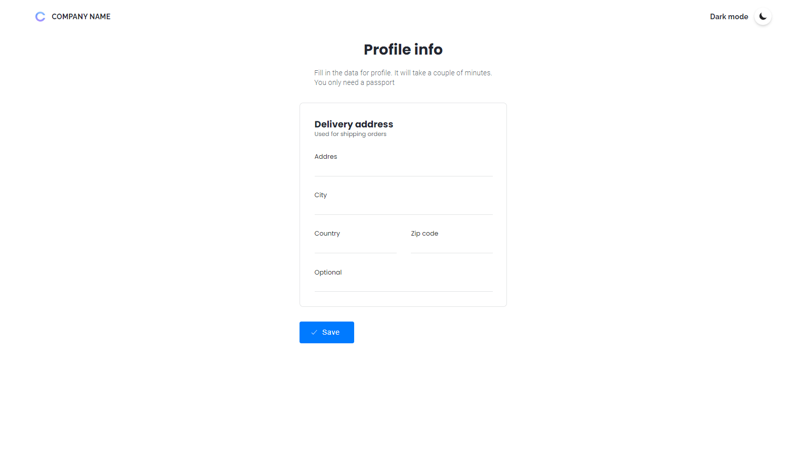

# Cadastro de Endereço
Projeto simples de cadastro de endereço, onde trata-se de um formulário utilizando HTML, CSS, JS & PHP, as informações deste formulário são enviadas para uma tabela do banco de dados que por sua vez não resulta em nenhuma continuação da aplicação.

Pretendo dar continuidade no desenvolvimento de mais telas para que se torne um sistema completo de login.

## Melhorias

- Dark & Light Mode
- Responsividade
- Diferentes linguagens (em desenvolvimento)

## Screenshots

    DARK MODE:

    

        
    

    LIGHT MODE:

    

        
    
